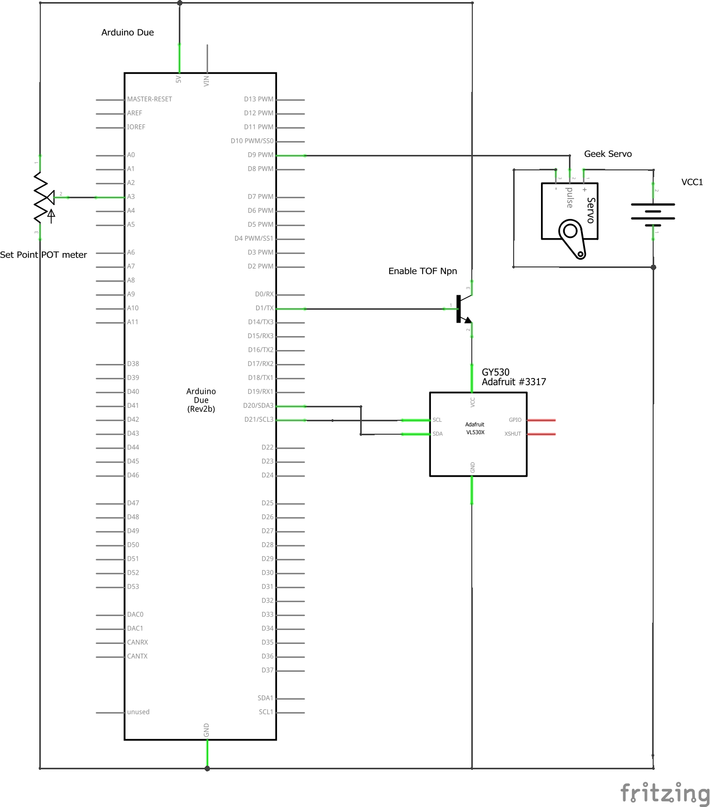
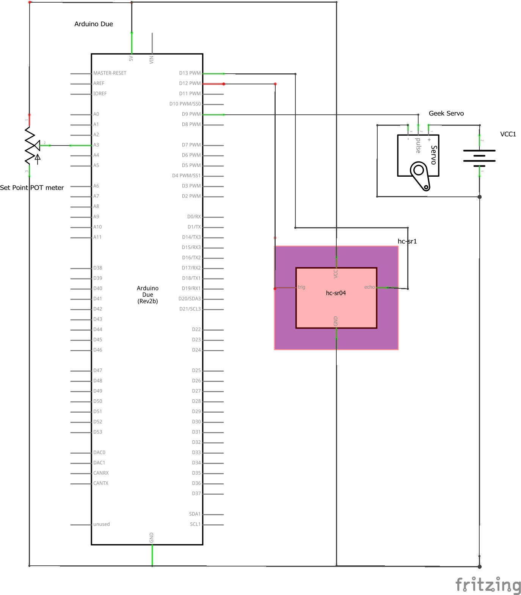
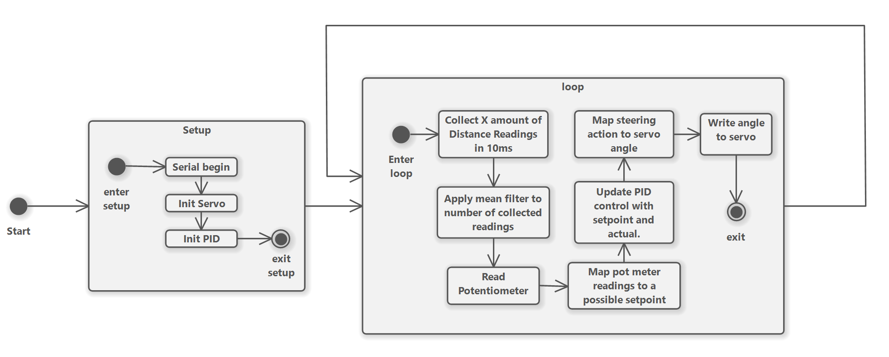

#MRB Project: Ball Balancer
#### Peter Schenkels

### Inleiding

In dit document ga ik beknopt bespreken hoe ik een "Bal op plank" PID systeem heb ontworpen in elkaar heb gezet door uit te leggen welke sensoren en actuatoren ik gebruikt heb, hoe de software en hardware in elkaar zit, hoe ik de PID waardes heb ingesteld en welke ik gekoze heb en hoe goed het systeem uiteindelijk gewerkt heeft. 

### Componenten
* #### distance sensors
  * **Sonar**
    De sonar is makkelijke en goedkope oplossing voor dit probleem. De sonar werkt door een hoog frequency geluids signaal te sturen en wachten op de terugkaatsing van het signaal via het object wat je wilt meten. Daardoor ben je wel afhankelijk van de snelheid van geluid, ook kan het zo zijn dat het geluids signaal verkeerd botsts en op een ander later tijdstip dan verwacht aankomt, waardoor de meting inacurraat wordt. 
  * **Infrared distance sensor**
    Net zoals de sonar werkt de infrared sensor ook door een signaal te sturen en met de tijd van wanneer het signaal terugkaatst te bepalen wat de afstand is. Alleen doet de infrared sensor dit via licht wat immens veel sneller is dan geluid. Ook heeft de infrared distance sensor een hoek detectie zodat de hoek gelijk meegenomen wordt in de bereking waardoor de berekening accurater wordt. Wel is een Infrared sensor duurder. Ook blijkt dat meeste infrared sensoren een minimum range van 10CM hebben waardoor het zetten van een setpoint minder flexibel wordt.
  * **Lidar**
    Een lidar werkt ook op dezelfde mannier maar dit keer door een laser. De laser kan schadelijk zijn voor je ogen en een lidar is heel duur dus deze laat ik buiten beschouwing.

  * **Time of Flight Distance Sensor**
    Time of flight sensor werkt ook via licht en kan snelle readings maken. Het is eigenlijk het beste van een infrared sensor alleen heeft deze een lagere minimum range. 

    |   Type                                    | Sonar | Lidar | IR     | ToF  |
    |---------------------------------------|-------|-------|--------|------|
    | prijs                                 | 1.50  | 50.0  | 4.50   | 3.00 |
    | Hoge Sample Rate                      | No    | Yes   | Yes    | Yes  |
    | Voor korte afstand                    | Yes   | Yes   | No | Yes/No   |
    | Gevoelig voor  externe omstandigheden | Yes   | No    | No     | No   |
    | Geschikt voor complexe voormen        | No    | Yes   | Yes    | Yes  |

    Uit het grafiek hierboven heb ik besloten dat ik voor een Time of Flight sensor ga. Hieronder ga ik 2 verschillende sensoren vergelijken die in het TI-lab te vinden zijn. 

    |    Type               | GY530 | VL6180 |
    |-------------------|-------------|-|
    | Operating Voltage (lower better) | 2.6v - 3.5v | 2.6v - 3.0v |
    | Supply-current (lower better) | 10mA | 1.7mA |
    | Min-range (lower better) | 3cm | 1cm |
    | Max-range | 200cm | 64cm |
    | Output protocol | $I^2C$ | $I^2C$  
    | Output format | Millimeters | Millimeters |
    | Resolution (lower better) | 0.03 mm/pb | 0.39 mm/pb |

* #### Servo's
  De servo gaat dienen als actuator voor mijn project. Het is belangrijk dat ik een stevige en stabiele sensor ga gebruiken. Aangezien ik Aliexpress lego heb gekozen als bouwmateriaal voor de balanceer brug moet ik een Servo vinden die makkelijk te verenigen is met het lego. Aangezien mijn ontwerp van de brug er voor zorgt dat de servo met weinig kracht de brug kan veranderen van hoek is een sterke servo niet nodig.

  * **Blauwe G9 servo**
  Het mooie aan deze servo's zijn is dat ze goedkoop en een redelijke range hebben. De blauwe 9g servo kan 180 graden draaien, heeft twee mounting plekken die met schroeven vast gezet kunnen worden en is intern helaas van plastic. Aangezien bij een PID van een balanceer brug de servo's vaak zouden moeten werken kunnen de interne tandwielen snel slijten. Als ik voor deze servo zou kiezen moet ik er rekening mee houden dat ze snel vervangen moeten worden. 

  * **MG9 Servo**
  De metal gear 9 servo heeft zoals de naam zegt metalen tandwielen van binnen waardoor deze servo meer aan kan. De servo heeft net zoals de blauwe 9g servo twee mounting point en een plastic behuizing. de bedrijfspanning is 4.8 tot 6 volt. Bij 6 volt zal de servo sneller kunnen veranderen van hoek. Ook kan deze servo 360 graden draaien. Voor mijn project moet de servo alleen 180 graden kunnen draaien. De servo is wel wat duurder dan de blauwe servo maar zou het investeren zeker waard zijn.

  * **Geek Servo**
  Het is niet helemaal bekend of de geek servo plastic of metalen tandwielen heeft maar wat wel duidelijk is dat deze servo makkelijk te verenigen is met lego. Dit is een enorm plus punt, omdat wie hierdoor meer stabiliteit in mijn ontwerp kunnen introduceren. Deze servo kan in een hoek van 270 graden draaien wat als ik al eerder noemde geen punt is aangezien 180 graden ook al prima is. Net zoals de metal gear servo draait deze servo in sneller bij een hoger voltage, de bedrijfs spanning gaat echter tot en met 5v en doet 0.1 seconden over een draai van 60 graden. De metal gear servo doet hier ook 0.1 seconden over.

      |    Type               | Geek Servo | MG9 Servo |
    |-------------------|-------------|-|
    | Operating Voltage (lower better) | 3v - 5v | 4.8v - 6v |
    | Speed | 600dps (at 5v) | 750dps (at 6v) |
    | Rotation range | 270 degrees | 360 degrees |
    | Compatible with Lego | Yes | No |
    | Price | 6 euro | 3 euro |

  Uit het grafiek hierboven haal ik dat ik voor de Geek Servo ga omdat stabiliteit voor mijn project belangrijker is dan snelheid en of prijs. De snelheid kan later nog worden aan gepast met gear ratio's als dit perse nodig is.

* #### Microcontroller boards
  Voor dit project is natuurlijk een microcontroller board nodig. Om met de actuatoren en sensoren te communiceren is vooral een microcontroller nodig die snel is en beschikt over een aantal GPIO porten. En om het project iets te vereenvoudige moet de microcontroller board ook welbekend zijn om het vinden van libraries makkelijker te maken. Prijs maakt niet alste veel uit aangezien ik een hoop bekende microcontroller boards thuis heb liggen dus het lijstje zal vooral daaruit bestaan.

    * **Arduino UNO**
    De Arduino uno staat bekend als grondlegger van de meeste DYI projecten. De UNO beschikt over een ATmega328P microcontroller. De processor draait op 20MHZ, heeft 32kb flash geheugen en beschikt over 2kb aan sram die we kunnen gebruiken tijdens het programmeren. Dit zijn niet hele indrukwekkende specificaties maar zou wel genoeg zijn om een PID Ball Balancer voor te maken. Echter ben ik opzoek naar een snellere microcontroller. 
    * **Arduino NANO**
    In principe is de Arduino NANO erg vergelijkbaar met de Arduino UNO. Ze beschikken beide over een 8bit ATmega328P microcontroller. Het grootste verschil tussen deze twee boards is de grootte. De Arduino NANO is namelijk erg klein. Dit maakt het breed inzetbaar.
    * **Arduino DUE**
    In het eerste jaar van Technische informatica kregen we al te maken met de Arduino DUE. De arduino due is een krachtige microcontroller board die beschikt over een hoop GPIO porten en een AT91SAM3X8E microcontroller. De microcontroller heeft een klok snelheid van 84mhz wat een stuk sneller is vergeleken met de arduino UNO. Ook beschikt de microcontroller over 512kb aan flash geheugen waardoor grotere programma's met meer libraries erop gezet kunnen worden. Aangezien we een PID gaan implimenteren is dit niet perse nodig maar wel een "Nice to Have". Ook heeft de microcontroller board 96kb aan sram wat ook niet perse nodig is maar wel een "nice to have" is. Wel is de arduino DUE een stuk groter dan de NANO en UNO. 

    |    Type               | Due | Nano |
    |-------------------|-------------|-|
    | Clock Speed |84mhz | 20mhz |
    | Instruction size |32bit | 8bit |
    | Flash memory | 512kb | 32kb | 
    | sram | 96kb | 2kb |
    | Size | Big | Small |

    Voor mij is de keuze duidelijk dat ik voor een Arduino DUE ga. Deze is namelijk sneller en heeft een grotere instruction size. Dit is handig aangezien ik met floating point waardes ga werken tijdens het berekenen van de Stuuractie van de PID. Floating point berekeningen zijn over het algemeen veel slomer dan integer berekeningen. Op een 8bit processor die al sloom is raak ik dan te veel kostbare tijd kwijt. 
  
  * #### De gebruikte sensoren en actuatoren
    Hieronder is het schema met de sensoren die ik in gebruik had genomen.
    
    Dit schema heb ik gebruikt voor het grootste gedeelte van het programmeer proces. Om met de Servo te interfacen heb ik de ingebouwde Arduino Servo library gebruikt om de servo mee aan te sturen. Voor de time of flight sensor (GY530) heb ik de Adafruit VL53L0X library gebruikt. Deze sensor moest meestal van de VCC of ground gehaald worden als de Arduino een restart had gedaan. Rede waarom dit was was mij niet bekend. Om dit op te lossen heb ik een NPN transitor tussen de vcc en de sensor geplaatst. In de code zet ik in de setup van de code voor de 10ms de base van de transistor op low en daarna weer op High om de sensor aan te zetten. Dit scheelde wat gevriemel met de jumper wires. De geek servo wordt door een ander 5v power source gesupplied aangezien de arduino niet zoveel kracht kan geven en om wat instabiliteit te halen uit het schema. Ook is er een 10k potentio meter aangesloten op de 4e adc pin om de set point mee te regelen tijdens runtime. Helaas kon ik mij tijdens het project niet de heletijd aan dit schema houden. Na een tijdje was de GY530 erg gevoelig voor beweging geworden en disconnecte snel wanneer de brug bewoog. Omdat de het lab dicht was en de deadline erg dichtbij heb ik een andere sensor die ik klaar had liggen gebruikt om als nog de PID werkend te krijgen. Veel keus had ik niet ik had alleen de HC sr04 liggen. Deze sensor was adequaat maar niet zo accuraat als de GY530. De hc sr04 had in mijn ervaring een nauwkeurigheid van ~1cm waardoor de PID controller instabieler werd. Hieronder is het schema met de HC sr04 weergeven.
    
### Filter technieken
Aangezien ik nu een hc sr04 heb kan ik sneller data kan ophalen van de sensor aangezien de sensor zelf geen filtering toepast. De gy530 deed er gemiddeld namelijk 30ms over om data op te halen meestal was het signaal dan al helemaal gefilterd. Om dan nog te wachten op meer samples was kostbaar. Ik heb er voor gekozen om een mean filter over de opgehaalde data te gooien. Het is mogelijk om binnen een ~10ms 10 samples op te halen. Zoals een mean filter werkt deel ik simpel weg de samples door het aantal opgehaalde samples om een accuratere sensor waarde te krijgen. Door een mean filter over de samples te gooien krijg je een soort lowpass filter. In ons geval kan het soms langer duren om een waarde op te halen dan de andere aangezien afstand een grote rol speelt in hoelang het duurt voordat een signaal is terug gekeerd. Hiervoor heb ik bedacht dat je aan de ophaal functie mee geeft hoelang hij er over mag doen. De functie mag dan in het op gegeven tijdsbestek zoveel mogelijk waardes ophalen als hij kan. 

### PID waardes
Voor het berekenen van de PID waardes heb ik een stappen plan gevolgd. Ik had alle waardes op nul gezet en de P waarde op een hoog nummer. Ik keek hoe erg het systeem reageerde op het balletje. Als de reactie te zwaar was halfeerde ik de P waarde. Wanneer het balletje rustigd oscilleerd en wanneer ik hem op zijn setpoint kan leggen zonder dat het systeem erop reageerd was voor mij een teken dat ik een correct P waarde had gevonden. In dit geval was dit 2.

Hierna ben ik aan de met het vinden van een juiste D waarde. Hiervoor heb ik de andere waardes op nul gezet en de D op ook een te hoog getal. Ook kijk ik weer hoe heftig erop reageerd en halfeer ik de waarde als het te heftig is. Dit doe ik een aantal keer totdat het systeem rustig maar snel naar een balletje kan stoppen met bewegen en op een willekeurige locatie stil kan houden. Voor mij was de D waarde 500.

Zodra ik de P en D waardes heb uitgerekend zet ik ze allebij aan en laat ik de I op 0. Hierna kijk of er een constante fout aanwezig is. In dit geval was deze niet aanwezig. Dus heb ik de I op nul gelaten.

### Systeem

In dit schema is te overzien wat er in de software gebeurt. Origineel wilde ik met rtos een wat complexere systeem in elkaar zetten. Een sensor read task die alleen maar bezig was met sensoren op halen. Een oled task om te laten zien wat de huidige actual, set point en PID waardes waren. Een potentiometer task waarmee een set point kon worden gegeven en een PID update task en een servo aansturing task aangezien de servo met 600 graden per seconde draait. Het opzetten van de rtos tasks ging prima alleen onderschatte ik hoe moeilijk het maken van een PID systeem precies was. Vooral het maken en designen van een fysiek bouwwerk. Ik vond het belangrijker om een basis PID systeem in elkaar te zetten dan alle bij taken.

### Resultaat
Het systeem werkt. Alleen werkt het niet zo goed als ik gehoopt had. In het filmpje is te zien dat het balletje langzaam naar zijn setpoint gaat met vallen en op staan. Een paar probleempjes die ik had was het kwaliteit lego wat ik gebruikte de accuraatheid van de sensoren en de lengte van de baan. 

De goedkope aliexpress lego was zoals verwacht niet al te stevig. Veel trilde en zat niet goed vast. In het filmpjen moest ik de stam stil houden om minder trilling en dus een beter resultaat te krijgen. 

De accuraatheid van de sensoren was ook een groot probleem. De hcsr04 en de GY540 hadden beide het probleem dat ze in accuraat werden na 30cm hierdoor fluctueerde de lezingen van de sensor veel meer wanneer het balletje verder weg van de sensor was waardoor het systeem erg instabiel werd. Hierdoor heb ik de lengte van de baan ook verkleind.

Omdat de lengte van de baan zo klein is heeft het balletje minder speling en moet de servo erg rustig bewegen om het balletje te verplaatsen. Als het balletje tegen een rand aan kwam en dus gelijk stopte, raakte de D van het PID systeem in paniek omdat er op een veel beweging is. Hierdoor gaf de brug een knikje waardoor het balletje weer snel ging bewegen. 

### Conclusie

Uiteindelijk is het wel gelukt om een relatief stabiel PID systeem te maken met alle complicaties die ik tijdens dit project tegen kwam. Nu ik alle jumper wires en lego van mijn bureau en de grond heb opgeruimd kan ik zeggen dat ik veel heb geleerd over hardware tijdens dit project. Vooral hoe je met bewegende onderdelen en hardware om moet gaan. Het kan af en toe frustrerend zijn maar dan kom je ook weer te weten dat: "Form follows function".

